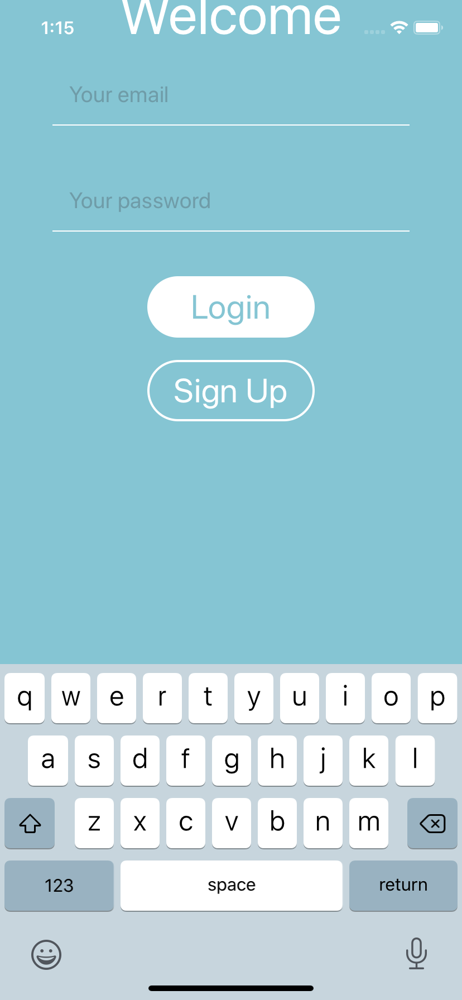

# React Native Front Project

Small clone of AirBnB with React Native & EXPO handling authentication and geolocation.

## Preview

## More

Now more features are available (Full map with all the rooms, user profile and updating pictures with Cloudinary)

